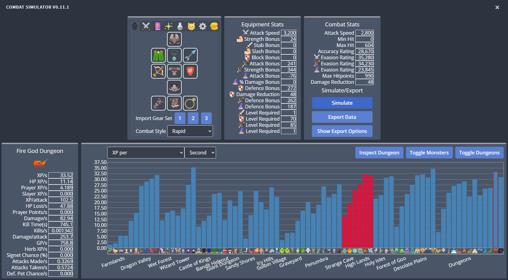
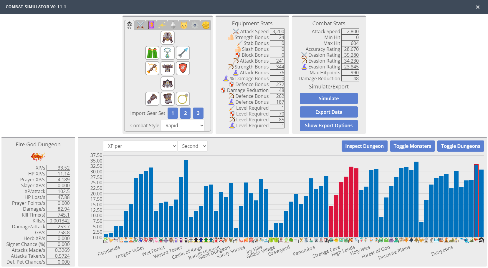

# Melvor Idle Combat Simulator Reloaded
A browser extension for the game [Melvor Idle](http://www.melvoridle.com/).
A fork of the great but no longer maintained [Melvor Idle Combat Simulator](https://github.com/coolrox95/Melvor-Idle-Combat-Simulator) by Coolrox95.

## How to Install
While this extension has been tested, it is still recommended to create a backup of your save file first.
After installing the extension, a refresh of the game may be required.

### Firefox:
Currently not available as a signed add-on, but you can [add it as temporary add-on](https://www.youtube.com/watch?v=J7el77F1ckg)

### Chrome:
Currently not available on the chrome webstore, but you can download the sources here and [add it as an unpacked extension](https://developer.chrome.com/extensions/getstarted)
1. Download [the latest version](/../../releases/latest) of the simulator
2. Unzip the files
3. Navigate to: chrome://extensions and toggle Developer mode on

4. Click "Load Unpacked" and navigate to the folder you unzipped to

5. Click "Select Folder"
6. The simulator should now be installed. You can disable or remove the extension from chrome://extensions

## Instructions
1. Open the simulator by clicking the Combat Simulator button in the Tools section in the game's sidebar (located between Skills and Minigame)
2. Select the tabs of the simulator and adjust the settings for your simulation
    - Equipment Tab: Allows you to change your equipment, combat style, and import gear sets from the game
        - To change equipment simply click on the slot you want to change and select equipment from the popup menu
        - To Import Gear Sets from the game click on the numbered buttons to import the corresponding gear set
            - Player Levels, Spells, Prayers, Potions and Pets will also be imported
        - Use the Combat Style dropdown menu to change the style for that weapon type
    - Levels Tab: Allows you to adjust the levels used in the simulation
        - Levels may be set to 'virtual' values above 99, these will not provide benefits to your stats but will factor into the calculation of pet chances
    - Spells Tab: Allows you to select Standard Spells, Curses, Auroras, and Ancient Magicks from their respective sub tabs
        - The level and item requirements of spells are respected
    - Prayers Tab: Allows you to select up to 2 Prayers that you meet the level requirements for
    - Potions Tab: Allows you to select a single combat potion
        - Use the Potion Tier dropdown to change the tier
        - Click on the potion icons to select the type
    - Pets Tab: Allows you to select which pets you own
    - Sim. Options Tab: Allows you to select advanced and assorted simulation options
        - Max Actions: Controls the maximum number of player actions before the simulation times out
        - \# Trials: Controls the number of times each enemy is simulated. Higher values lead to more accuracy at the expense of longer computation time.
        - Signet Time (h): The time period (in hours) used for the 'Chance for Signet Part B' calculation
        - Slayer Task: Whether to consider monsters killed to be part of a slayer task
            - Impacts Slayer pet chance, Slayer's Crossbow, and Slayer XP calculations
        - Hardcore Mode: Whether to use the hardcore combat triangle and disable passive regeneration
    - GP Options Tab: Various setting that adjust the way the GP per X calculations are performed
        - Sell Bones: Whether or not to sell bones
        - Convert Shards: Whether or not to convert elemental shards from god dungeons into elemental chests
     - Sell Loot: Whether or not to sell all loot, a subset of loot or none of it
        - When subset is selected you may edit which items to sell, by clicking Edit Subset
        - Selecting Set Default will change the subset to keep combat unique items
        - Selecting Set Discovered will change the subset to keep undiscovered items
        - Hitting Cancel will prevent the subset from changing
        - Hitting Save will confirm the current settings
3. Toggle the simulation of individual monsters or dungeons by clicking on their image below the plot or toggle groups by clicking the Toggle Dungeon/Monster buttons
    - Disabling an entry will also remove its bar from the plot and adjust the data scaling based on the remaining bars
4. Hit the Simulate button and wait for the simulation to finish
    - The button can be pressed again to cancel a simulation early
5. Select the Plot Type to visualize simulation results
    - XP per X: Experience points per X for selected combat style's skills
    - HP XP per X: Experience points per X for the Hitpoints skill
    - Prayer XP per X: Experience points per X for the Prayer skill
    - Slayer XP per X: Experience points per X for the Slayer skill
    - XP per Attack: Average amount of experience points per attack
    - HP loss per X: Average amount of HP lost per X, including regeneration effects
    - Prayer Points per X: Average amount of prayer points per X consumed
    - Damage per X: Average damage dealt per X
    - Average Kill Time (s): The average time in seconds to kill an enemy or to clear a dungeon
    - Kills per X: The average number of kills or dungeon clears per X
    - Damage per Attack: The average amount of damage done per attack
    - GP per X: The average amount of GP earned per X
    - Potential Herblore XP per X: The potential herblore xp earned using lucky herb potions, asssuming you use the herbs to craft the most xp efficient potions
    - Chance for Signet Part B(%): The probability to gain at least 1 Signet Ring Half B after fighting a monster for Signet Time (h) hours
    - Attacks Made per X: Average number of calls to attackEnemy() per X
        - This can be used to determine most combat potion charge usages, ammunition usage and rune usage
    - Attacks Taken per X: Average number of calls to attackPlayer() per X
        - This can be used to determine potion charge usage for combat potions that consume charges on enemy attacks
    - Y Pet Chance per X: The probability to receive Y pet in the given time period
        - Pets are rolled for when you earn experience of the given type, except for the slayer pet which is only rolled for upon killing an active slayer task monster
6. Click on a bar to view detailed information about that monster or dungeon
    - You can click Inspect Dungeon to view the simulation results for individual monsters inside a dungeon
7. Export Data to your Clip Board by clicking the Export Data button
    - You can change the options for this export by clicking Show Export Options
        - Dungeon Monsters toggles whether the individual monsters from dungeons should be exported
        - Non-Simulated toggles whether simulations that have been toggled off should be exported
        - Data to Export provides toggles for what information to export

## A Note On Simulation Accuracy
This simulator assumes that the game is running with absolutely no slowdowns, and each action is proccessed instantaneously. In reality this is not true, and measured rates will tend to be lower than simulation results.

In addition the calculation for hitpoints used per second assumes there is no cap on player hitpoints (It simply sums the damage taken and subtracts all possible healing). Actual results will tend to be higher.

### Known Issues:

## Screenshots
### Dark Mode

### Light Mode

## Suggestions and Feedback
Found a bug or want to request a feature?
Feel free to message me on the [Melvor Idle Discord](https://discord.gg/TWDT7PM) or [create an issue](/../../issues) on this repository.
